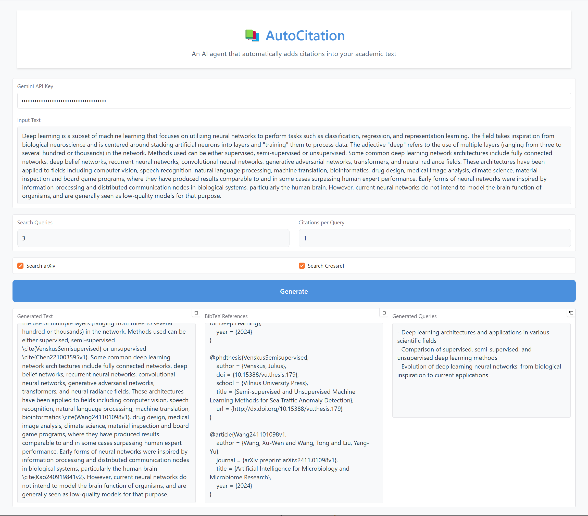

# Citation Generator

An intelligent citation assistant that helps you find relevant academic papers and generate citations in LaTeX for your text using Google's Gemini AI and arXiv integration.



## Prerequisites

- Python 3.9 or higher
- Google Gemini API key (free)

## Installation

1. Clone this repository
2. Install the required dependencies:
   ```bash
   pip install -r requirements.txt
   ```
3. Create a `.env` file in the root directory and add your Gemini API key:
   ```
   GEMINI_API_KEY=your_api_key_here
   ```

## Usage

1. Run the application:
   ```bash
   python main.py
   ```
2. Enter your text in the input area
3. Set the desired number of queries and citations
4. Click "process" to process your text
5. Use the copy buttons to copy the cited text or BibTeX entries

## Acknowledgements

AI can be a powerful tool for finding citations, but it is important to verify the results and ensure that the citations are accurate and appropriate. This tool is intended to assist with the citation process, but it is not a substitute for careful research and review of the sources.

## License

This project is open source and available under the MIT License.
